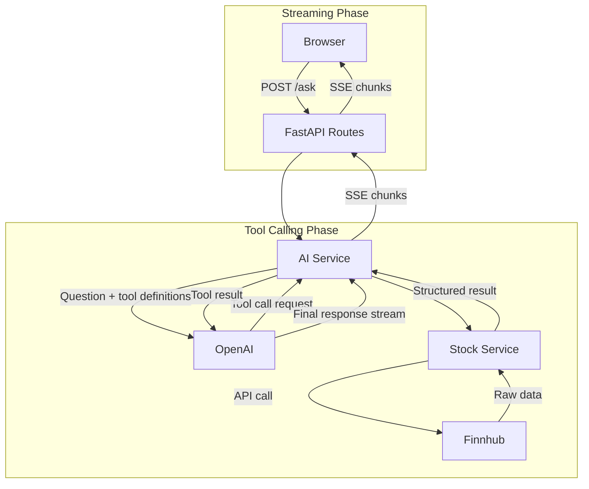

# Stock Insights Assistant

A web application that allows users to ask natural language questions about stocks and receive AI-powered answers using OpenAI's function calling capabilities and real-time stock data from Finnhub.

## Architecture Overview

The application follows a clean, layered architecture with clear separation of concerns. The frontend is a simple HTML/JavaScript chat interface that communicates with a FastAPI backend via REST endpoints. When a user submits a question, the backend routes it to the AI service, which uses OpenAI's function calling (tool calling) feature. OpenAI analyzes the question and decides which stock data tools to invoke—such as fetching quotes, company profiles, comparisons, or news. The AI service executes these tools via the stock service, which wraps the Finnhub Python client and handles all external API calls. Results are passed back to OpenAI, which synthesizes them into a natural language response that's returned to the user.

The design emphasizes dependency injection (clients are passed as parameters) to enable easy testing, graceful error handling at every layer, and a simple request-response flow without over-engineering. The stock service functions are pure and testable, while the AI service manages the tool-calling loop and conversation state. Configuration is centralized using Pydantic settings with environment variable validation, ensuring clear error messages if API keys are missing.



## How to Run

### Prerequisites

- Python 3.10 or higher (for local deployment)
- Docker and Docker Compose (for containerized deployment)
- OpenAI API key
- Finnhub API key (free tier available at [finnhub.io](https://finnhub.io))

### Docker Deployment
1. Clone the repository and navigate to the project directory:
   ```bash
   cd ai-stock-assistant
   ```

2. Create a `.env` file from the example:
   ```bash
   cp .env.example .env
   ```

3. Edit `.env` and add your API keys:
   ```
   OPENAI_API_KEY=your_openai_api_key_here
   FINNHUB_API_KEY=your_finnhub_api_key_here
   ```

4. Build and run with Docker Compose:
   ```bash
   docker compose up --build
   ```

5. The application will be available at `http://localhost:8000`

6. To run tests:
   ```bash
   docker compose run --rm web pytest
   ```
7. To run linting:
   ```bash
   docker compose run --rm web ruff check . --fix
   ```

### Local Development

1. Clone the repository and navigate to the project directory:
   ```bash
   cd ai-stock-assistant
   ```

2. Create a `.env` file from the example:
   ```bash
   cp .env.example .env
   ```

3. Edit `.env` and add your API keys:
   ```
   OPENAI_API_KEY=your_openai_api_key_here
   FINNHUB_API_KEY=your_finnhub_api_key_here
   ```

4. Install dependencies:
   ```bash
   pip install -e ".[dev]"
   ```

5. Run the application:
   ```bash
   uvicorn app.main:app --reload
   ```

6. Open your browser to `http://localhost:8000`

7. To run tests
   ```bash
   pytest
   ```
8. To run linting
   ```bash
   ruff check .
   ```

## Trade-offs and Decisions

- **Simple Frontend**: Chose vanilla HTML/JS over a framework to keep the project lightweight and focused on the backend AI integration. This reduces complexity and makes the codebase easier to understand.

- **Synchronous Stock Service**: The Finnhub client is synchronous, so stock service functions are synchronous. The AI service is async to handle concurrent requests efficiently, but tool execution happens in a thread pool implicitly when needed.

- **Tool Calling Loop Limit**: Implemented a hard cap of 3 iterations in the tool-calling loop to prevent infinite loops. In production, you might want to make this configurable or add more sophisticated termination logic.

- **Error Handling Strategy**: All stock service functions return structured error responses (Pydantic models with error fields) rather than raising exceptions. This ensures the AI always receives a response it can work with, even when APIs fail.

- **No Database**: The application is stateless—no conversation history is persisted. This keeps the architecture simple and highly scalable but means users can't reference previous questions. For production, you'd want to add session management and storage.

- **Scope Restriction via System Prompt**: Deliberately restricted the assistant to stock-related queries only through the system prompt, rather than building keyword filtering logic. This keeps the scope focused and leverages the LLM's natural language understanding to handle edge cases gracefully.

- **Rate Limit Handling**: OpenAI rate limit errors are caught explicitly and returned as a user-friendly message rather than a generic server error. In production this would be complemented by request queuing or per-user rate limiting to prevent hitting limits in the first place.

## What I Would Improve with More Time

1. **Conversation Memory**: Add session management and store conversation history so the AI can reference previous questions and maintain context across multiple interactions.

2. **Caching**: Add caching for frequently requested stock data (e.g., quotes) to reduce API calls and improve response times. Redis would be a good fit here.

3. **Input Validation**: Add more robust input validation and sanitization, especially for ticker symbols, to prevent injection or invalid API calls.

4. **Monitoring and Logging**: Add structured logging, metrics collection, and health check endpoints for production observability.

5. **Frontend Enhancements**: Improve the UI with markdown rendering for AI responses, syntax highlighting for stock data, and better mobile responsiveness.

## AI Tooling Usage

This project was built using two AI tools in a deliberate workflow:

**Claude (via claude.ai)** was used upfront for architecture planning and 
decision making before writing any code. This included designing the overall 
project structure, deciding on FastAPI over alternatives like Streamlit, 
choosing OpenAI tool calling over a simpler prompt-based approach, mapping 
out the request flow, and thinking through the testing strategy. Using a 
conversational interface at this stage was valuable for exploring trade-offs 
and arriving at a clear plan before touching code.

**Cursor (with Claude)** was then used to scaffold and build the application 
based on that plan. A detailed prompt capturing the architecture decisions, 
folder structure, and technical requirements was used to generate the initial 
scaffold. Cursor was then used iteratively to fix issues, resolve errors, and 
refine the implementation - with each change reviewed and understood before 
being accepted.

This two-stage approach - planning in chat, building in an agentic IDE - 
proved effective. The upfront planning meant the scaffold prompt was specific 
enough that Cursor produced clean, well-structured code first time, minimising 
the need for large corrections later.
